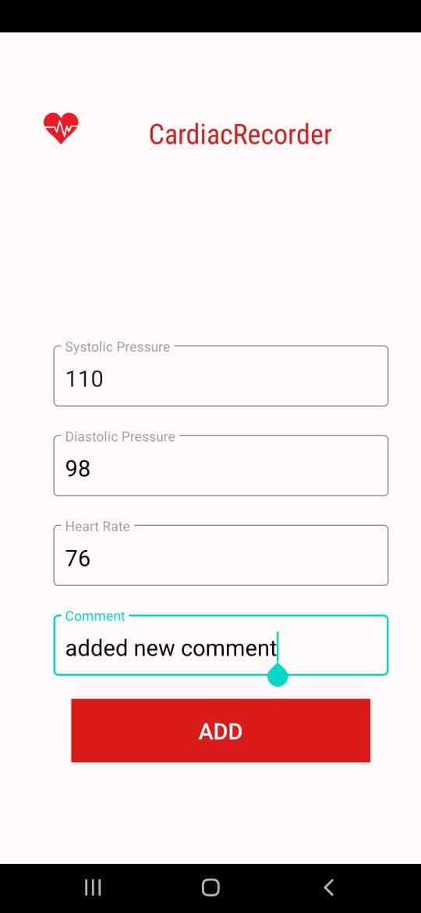

# CardiacRecorder4558

An android app that helps a user to track his blood pressure and heart rate and signals for normal or abnormal values.

## Authors

- [@nadim1807045](https://www.github.com/nadim1807045)
- [@mahfuj14](https://www.github.com/mahfuj14)

## Badges

Add badges from somewhere like: [shields.io](https://shields.io/)

## FAQ

#### Can Users make changes in saved records?

Yes. Users can update and delete all the values frequenly 

#### Does the app measure blood pressure and pulse?
No. The app is just for tracking manually.You have to give input of every data. No measurement is possible.

## Contributing

You can contribute if you want!

- Fork the Project.
- Create your Feature Branch (git checkout -b feature/AmazingFeature).
- Commit your Changes (git commit -m 'Add some AmazingFeature').
- Push to the Branch (git push origin feature/AmazingFeature).
- Open a Pull Request.

## Screenshots

## Documentation

The Documentation is for to clearup the concepts about the app and the brief discussion of development tools and methods. Click [Here!](https://linktodocumentation)

## License

Distributed Under [MIT](https://choosealicense.com/licenses/mit/) License.

## Features

- Keep the track of your Systolic and Diastolic blood pressure.
- User can mark their heart rate every day.
- There will be an alert symbol that identify your contidion.
- Users can add comments according to their health condition.
- Everything will be shown in a combined frame.
- users can update their given inputs.
- Any previous record can be deleted if you want.

## Thank you for your Time.
